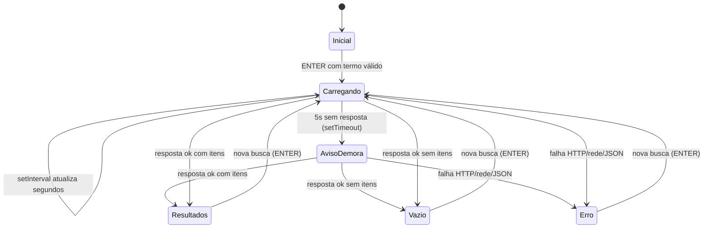

# Projeto: Buscador de Repositórios no GitHub

> Este é o documento que você deve seguir para desenvolver o projeto. Ele traduz a ideia original do buscador de repositórios do GitHub em requisitos de Análise e Desenvolvimento de Sistemas, usando apenas os conhecimentos listados em [temas.md](./temas.md): síncrono vs. assíncrono, `setTimeout`/`setInterval`/`clearTimeout`/`clearInterval`, Promises e seus três estados, `.then()`/`.catch()`/`.finally()`, API REST/JSON/HTTP, `fetch`, `async/await` e tratamento de erros com `try/catch` (status codes e erros de rede).
>
> Não use frameworks, bibliotecas de UI, bundlers, módulos ES (`import`/`export`) ou classes. O objetivo é você escrever o HTML, CSS e JavaScript com as próprias mãos — as únicas habilidades assumidas como pré-requisito, não cobertas por `temas.md`, são manipulação básica do DOM (`querySelector`/`getElementById`, `addEventListener`, criar/alterar elementos), HTML/CSS básicos, e um bloco de 3 linhas ao final de `src/app.js` (seção 8.3) que só existe para os testes automatizados conseguirem enxergar suas funções — copie-o, não é necessário estudá-lo. Use os testes em [/test](../test) como especificação executável.

## 1. Objetivo do projeto

Construir uma página web onde a pessoa usuária digita um termo, pressiona ENTER e recebe até 10 repositórios públicos do GitHub, ordenados por estrelas, consultados via API REST com `fetch`. O exercício central é dominar o ciclo de uma requisição assíncrona: dispará-la, manter a interface responsiva, medir o tempo decorrido, avisar sobre demora e tratar sucesso, resposta vazia e erro sem deixar timers "vazando".

## 2. Como usar este documento

1. Leia [temas.md](./temas.md) e estude cada subtema antes de codar.
2. Leia as seções 3 a 8 abaixo para entender requisitos, contrato técnico e telas.
3. Rode a suíte de testes (seção 9) — ela começa **falhando**, pois o código ainda não existe. Isso é esperado.
4. Implemente `index.html`, `src/style.css` e `src/app.js` seguindo o contrato técnico até os testes passarem (`npm test`).
5. Não altere os arquivos em `/test` para "forçar" a passagem — se um teste parecer errado, revise antes o seu entendimento do requisito.

## 3. Requisitos funcionais (RF)

| ID | Requisito |
| --- | --- |
| RF01 | O sistema inicia a busca somente quando a tecla ENTER é pressionada no campo de busca. |
| RF02 | O sistema ignora buscas com termo vazio ou composto somente por espaços (nenhuma requisição é feita). |
| RF03 | O sistema consulta `GET https://api.github.com/search/repositories?q={termo}&sort=stars&per_page=10` usando `fetch`, com o termo codificado para URL. |
| RF04 | O sistema exibe até 10 repositórios retornados em `items`, na ordem em que a API os devolve. |
| RF05 | Cada resultado exibe: avatar e login do autor, nome do repositório, descrição (ou texto substituto quando ausente), linguagem principal (ou texto substituto quando ausente), número de estrelas e link para a página do repositório no GitHub. |
| RF06 | Enquanto a busca está em andamento, o sistema exibe uma mensagem de carregamento com o número de segundos decorridos, atualizado a cada segundo. |
| RF07 | Se a busca ultrapassar 5 segundos em andamento, o sistema exibe um aviso adicional de demora, sem cancelar a requisição em curso. |
| RF08 | Se a resposta não contiver repositórios, o sistema exibe um estado vazio. |
| RF09 | Se ocorrer falha HTTP (status não-ok), falha de rede (`fetch` rejeitada) ou falha ao interpretar o JSON, o sistema exibe uma mensagem de erro amigável e permite nova tentativa. |
| RF10 | Uma nova busca substitui completamente o estado da busca anterior: resultados antigos, mensagens e timers da busca anterior são encerrados/limpos antes ou durante o início da nova busca. |
| RF11 | Links de repositório abrem em nova aba com `target="_blank"` e `rel="noopener noreferrer"`. |

## 4. Requisitos não funcionais (RNF)

| ID | Requisito |
| --- | --- |
| RNF01 | Implementação apenas com HTML, CSS e JavaScript nativos — sem frameworks, bibliotecas de UI ou bundlers. |
| RNF02 | Todo event listener é registrado via `addEventListener` no JavaScript; o HTML não usa atributos de evento inline (`onclick`, etc.). |
| RNF03 | Nenhum `setTimeout`/`setInterval` permanece ativo após uma busca terminar (sucesso, erro ou substituição por nova busca). |
| RNF04 | Layout centralizado, largura máxima de 700px, fundo da página mais escuro que os cards de busca/resultados. |
| RNF05 | O JavaScript da aplicação expõe funções puras via `module.exports` (guardado para não quebrar no navegador — ver seção 8.3), permitindo testá-las com Jest sem bundler/transpilador. |
| RNF06 | Uso apenas de APIs nativas do navegador (`fetch`, DOM, timers) suportadas por navegadores modernos, sem polyfills. |
| RNF07 | O código deve passar em `npm test` na raiz do projeto antes de ser considerado concluído. |

## 5. Fluxo principal (visão de processo)



Regra chave: ao sair de `Carregando`/`AvisoDemora` para qualquer outro estado (ou ao reentrar em `Carregando` por uma nova busca), os timers da busca anterior (`clearTimeout` do aviso e `clearInterval` do contador) precisam ser encerrados.

## 6. Escopo de tela — baixa fidelidade (wireframe)

```
┌──────────────────────────────────────────────┐
│                 (fundo escuro)                │
│   ┌────────────────────────────────────────┐  │  ← largura máx. 700px
│   │  Buscador de Repositórios GitHub        │  │
│   │  ┌────────────────────────────────┐     │  │
│   │  │ [ termo de busca...     ] ⏎    │     │  │  ← input + ENTER
│   │  └────────────────────────────────┘     │  │
│   │  status: "Buscando... 3s"                │  │  ← região de status
│   │                                          │  │
│   │  ┌────────────────────────────────────┐  │  │
│   │  │ [avatar] autor/nome-do-repo   ★123 │  │  │  ← card de resultado
│   │  │ descrição do repositório           │  │  │
│   │  │ linguagem: JavaScript   [abrir ↗] │  │  │
│   │  └────────────────────────────────────┘  │  │
│   │  ┌────────────────────────────────────┐  │  │
│   │  │ [avatar] autor/outro-repo    ★45  │  │  │
│   │  │ ...                                 │  │  │
│   │  └────────────────────────────────────┘  │  │
│   └────────────────────────────────────────┘  │
└──────────────────────────────────────────────┘
```

Estado vazio e estado de erro reutilizam a mesma região de status, substituindo a lista de resultados por uma única mensagem:

```
status: "Nenhum repositório encontrado para 'xyzxyz'."
status: "Não foi possível concluir a busca. Tente novamente."
```

## 7. Escopo de tela — alta fidelidade (guia de estilo)

- Fundo da página: cinza-azulado bem escuro (ex.: `#12141a`).
- Card central: tom mais claro que o fundo (ex.: `#1c1f27`), cantos arredondados (`8px`), sombra sutil.
- Campo de busca: destaque com borda em foco; largura 100% do card.
- Tipografia: fonte do sistema (`system-ui`, `sans-serif`), título em peso maior, texto de status em tom secundário (cinza-claro).
- Cards de resultado: avatar circular (32–40px) à esquerda, nome do repositório em destaque, descrição em texto secundário truncável, rodapé do card com linguagem e estrelas alinhados à esquerda e link "abrir" alinhado à direita.
- Espaçamento consistente entre cards (`12–16px`).
- Cores de estado: aviso de demora em amarelo/laranja suave; erro em vermelho suave; nunca usar apenas cor para transmitir estado — sempre acompanhar de texto.

## 8. Contrato técnico (obrigatório para os testes passarem)

### 8.1 Estrutura de arquivos

```
/
├── index.html
├── src/
│   ├── style.css
│   └── app.js
└── test/
    ├── unit/
    └── dom/
```

### 8.2 IDs e classes esperados no `index.html`

| Elemento | Seletor |
| --- | --- |
| Formulário de busca | `#search-form` |
| Campo de texto | `#search-term` |
| Região única de status (carregando/aviso/vazio/erro) | `#status-message` |
| Lista de resultados | `#results-list` |
| Cada item de resultado | classe `.repo-item` dentro de `#results-list` |
| Avatar do item | `.repo-item img.repo-avatar` |
| Autor/nome do repositório | `.repo-item .repo-fullname` |
| Descrição | `.repo-item .repo-description` |
| Linguagem | `.repo-item .repo-language` |
| Estrelas | `.repo-item .repo-stars` |
| Link do repositório | `.repo-item a.repo-link` (com `target="_blank"` e `rel="noopener noreferrer"`) |

O formulário deve poder ser submetido pressionando ENTER dentro de `#search-term` (use um elemento `<form id="search-form">` com `<input>` dentro, ouvindo o evento `submit`, e chame `event.preventDefault()`).

### 8.3 Funções que `src/app.js` deve exportar

`src/app.js` deve terminar com este bloco, exatamente como está (é apenas um "encaixe" para os testes automatizados enxergarem suas funções — não é um tema para estudar, só copie):

```js
if (typeof module !== "undefined" && module.exports) {
  module.exports = { buildApiUrl, parseRepoItem, getFriendlyErrorMessage, init };
}
```

| Função | Assinatura | Comportamento esperado |
| --- | --- | --- |
| `buildApiUrl(termo)` | `(string) => string` | Retorna a URL completa da API com o termo codificado (`encodeURIComponent`) e `sort=stars&per_page=10`. |
| `parseRepoItem(item)` | `(object) => object` | Recebe um item bruto da API e retorna `{ author, avatarUrl, name, description, language, stars, htmlUrl }`, usando um texto substituto (ex.: `"Sem descrição"`, `"Não informado"`) quando `description`/`language` forem `null`/ausentes. |
| `getFriendlyErrorMessage(erro)` | `(Error \| Response \| unknown) => string` | Retorna uma mensagem amigável em português, distinguindo (quando possível) falha de rede de falha HTTP. |
| `init()` | `() => void` | Localiza os elementos pelo contrato da seção 8.2, registra os listeners (`addEventListener`) e prepara o estado inicial. |

### 8.4 Regras de timer que os testes verificam

- Ao iniciar uma busca: `setInterval` atualiza o contador de segundos a cada 1000ms; `setTimeout` de 5000ms dispara o aviso de demora.
- Ao finalizar a busca (sucesso, vazio ou erro) ou ao iniciar uma nova busca: o `clearInterval` e o `clearTimeout` da busca anterior devem ser chamados antes de qualquer novo timer ser criado.

## 9. Testes como especificação

A suíte em [/test](../test) já está pronta e **define o comportamento esperado**. Rode:

```bash
npm install
npm test
```

Os testes falham até você implementar `index.html` e `src/app.js`. Implemente incrementalmente:

1. Comece pelos testes em `test/unit/` (funções puras, sem DOM).
2. Depois implemente `index.html` + os listeners em `init()` para passar `test/dom/`.

Não modifique os arquivos dentro de `/test`.

## 10. Fora de escopo

Paginação, autenticação, persistência, busca enquanto digita (debounce), filtros, bibliotecas de UI e qualquer funcionalidade além da busca única por ENTER descrita aqui.
